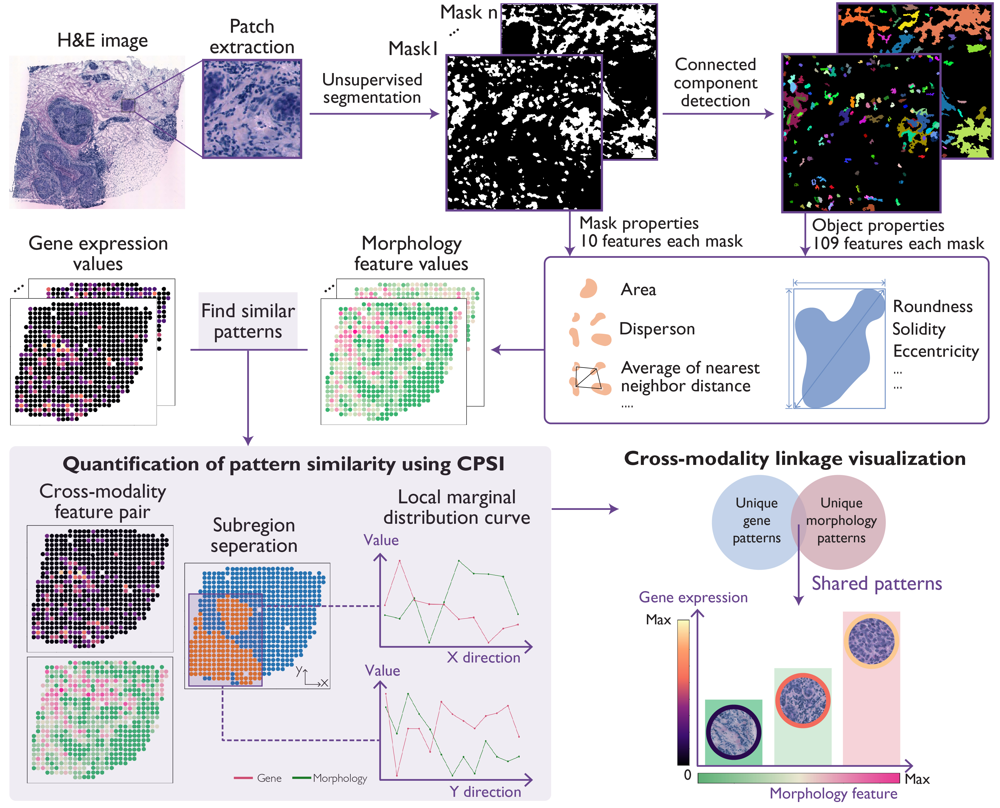

# MorphLink  v1.0.4

## MorphLink: Bridging Cell Morphological Behaviors and Molecular Dynamics in Multi-modal Spatial Omics

#### Jing Huang, Chenyang Yuan, Jiahui Jiang, Jianfeng Chen, Sunil S. Badve, Yesim Gokmen-Polar, Rossana L. Segura, Xinmiao Yan, Alexander Lazar, Jianjun Gao, Bing Yao, Michael Epstein, Linghua Wang* and Jian Hu*

MorphLink is a computational framework to systematically extract and link interpretable morphological features with molecular measurements in multi-model spatial omics analyses. The identified linkages provide a transparent depiction of cellular behaviors that drive transcriptomic heterogeneity and immune diversity across different regions within diseased tissues. Moreover, MorphLink is scalable and robust against cross-sample batch effects, making it an efficient method for integrating spatial omics data analysis across samples, cohorts, and modalities, and enhancing the interpretation of results for large-scale studies. MorphLink is applicable to various types of spatial omics data, including spatial transcriptomics (Spatial Transcriptomics, 10x Visium, 10x Xenium, and MERFISH), spatial proteomics (CODEX and IMS), and the simultaneous measurement of proteins and transcriptome (spatial CITE-seq and CosMx). 

 
For thorough details, see the preprint: [Biorxiv](https://www.biorxiv.org/content/10.1101/2024.08.24.609528v1)
 

## Usage

With [**MorphLink**](https://github.com/jianhuupenn/MorphLink) package, you can:

- Extract interpretable morphological features from histology images in a label-free manner.
- Quantify the relationships between cell morphological and molecular features in a spatial context.
- Visually examine how cellular behavior changes from both morphological and molecular perspectives.

## Tutorial

For the step-by-step tutorial, please refer to: 
 
https://github.com/jianhuupenn/MorphLink/blob/main/tutorial/tutorial.md
 
 
A Jupyter Notebook of the tutorial is accessible from: 
 
https://github.com/jianhuupenn/MorphLink/blob/main/tutorial/tutorial.ipynb
 
Please install Jupyter in order to open this notebook.
 
 
Toy data can be downloaded at: 
 
https://drive.google.com/drive/folders/1NgJICg1jFD2HP7WGZ9vXk7GrRJRoFfSD?usp=sharing
 
Pre-generated image features can downloaded at:
 
https://github.com/jianhuupenn/MorphLink/blob/main/tutorial/results
 
Intermediate results and figures are saved at:
 
https://github.com/jianhuupenn/MorphLink/blob/main/tutorial/figures
 
 

## System Requirements
Python support packages: pandas, numpy, numba, scipy, scanpy, anndata, scikit-learn, scikit-image, matplotlib, imutils, opencv-python, leidenalg.

## Versions the software has been tested on
Environment 1:
- System: Mac OS Sonoma 14.0 (M1 Pro)
- Python: 3.11.5
- Python packages: pandas = 2.1.4, numpy = 1.26.2, numba = 0.58.1, scipy = 1.11.4, scanpy = 1.9.6, anndata = 0.10.3, scikit-learn = 1.3.2, scikit-image = 0.23.2, matplotlib = 3.8.2, imutils = 0.5.4, opencv-python = 4.8.1, leidenalg = 0.10.2.

Environment 2:
- System: Anaconda (23.9.0)
- Python: 3.11.5
- Python packages: pandas = 2.0.3, numpy = 1.24.3, numba = 0.57.1, scipy = 1.11.1, scanpy = 1.9.8, anndata = 0.10.8, scikit-learn = 1.3.0, scikit-image = 0.20.0, matplotlib = 3.7.2, imutils = 0.5.4, opencv-python = 4.10.0, leidenalg = 0.10.2.

Environment 3: 
- System: Mac OS Big Sur 11.6.1 (Intel i9)
- Python: 3.8.9
- Python packages: pandas = 1.3.4, numpy = 1.20.3, numba = 0.54.1, scipy = 1.7.1, scanpy = 1.9.5, anndata = 0.9.1, scikit-learn = 1.0.1, scikit-image = 0.18.3, matplotlib = 3.7.1, imutils = 0.5.4, opencv-python = 4.5.4, leidenalg = 0.8.8.

## Contributing

Souce code: [Github](https://github.com/jianhuupenn/MorphLink)  

We are continuing adding new features. Bug reports or feature requests are welcome. 

Last update: 11/26/2024, version 1.0.4

## References

Please consider citing the following reference:

- https://doi.org/10.1101/2024.08.24.609528

 
